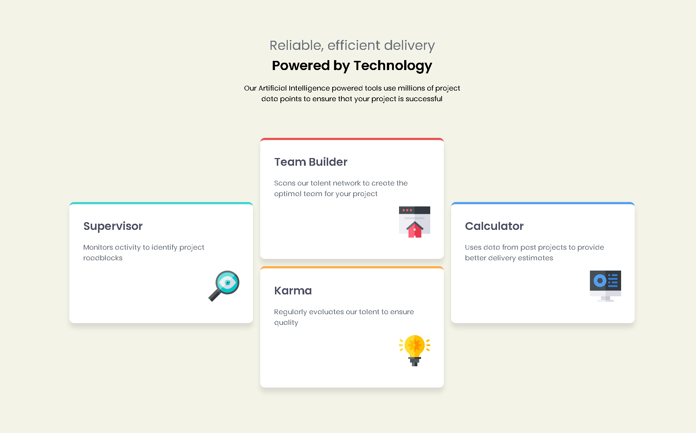
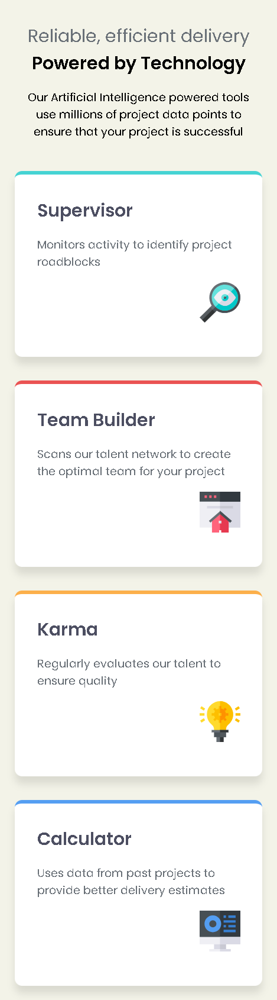

# Frontend Mentor - Four card feature section solution

This is a solution to the [Four card feature section challenge on Frontend Mentor](https://www.frontendmentor.io/challenges/four-card-feature-section-weK1eFYK).

## Table of contents

- [Overview](#overview)
  - [The challenge](#the-challenge)
  - [Screenshot](#screenshot)
  - [Links](#links)
- [My process](#my-process)
  - [Built with](#built-with)
  - [What I learned](#what-i-learned)
  - [Continued development](#continued-development)
  - [Useful resources](#useful-resources)
- [Author](#author)

## Overview

### The challenge

Users should be able to:

- View the optimal layout for the site depending on their device's screen size

### Screenshot





### Links

- [Solution URL](https://github.com/ffozdemir/four-card-feature-section)
- [Live Site URL](https://glittery-brigadeiros-f774c6.netlify.app)

## My process

### Built with

- Semantic HTML5 markup
- CSS custom properties
- Flexbox
- CSS Grid
- Mobile-first workflow

### What I learned

During this project, I improved my understanding of responsive design principles and CSS Grid. Here's an example of a CSS snippet I used:

```css
main {
  display: grid;
  grid-template-columns: repeat(3, minmax(200px, 1fr));
  gap: 1rem;
}
```

### Continued development

In future projects, I want to focus more on accessibility and improving performance for larger-scale applications.

### Useful resources

- [CSS Tricks - A Complete Guide to Grid](https://css-tricks.com/snippets/css/complete-guide-grid/) - This guide helped me understand CSS Grid better.
- [MDN Web Docs - Responsive Design](https://developer.mozilla.org/en-US/docs/Learn/CSS/CSS_layout/Responsive_Design) - A great resource for learning about responsive design.

## Author

- Frontend Mentor - [@ffozdemir](https://www.frontendmentor.io/profile/ffozdemir)
- GitHub - [@ffozdemir](https://github.com/ffozdemir)
